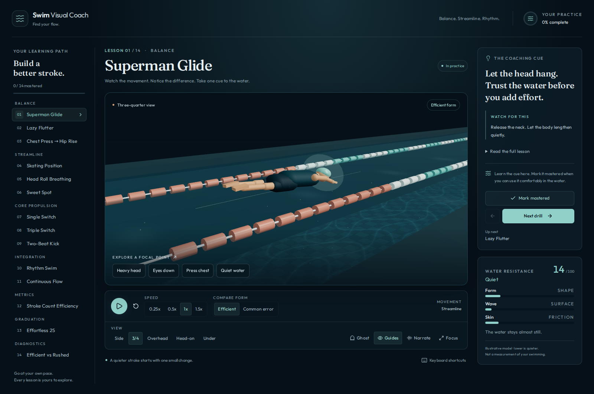

# Coaching workspace acceptance

The workspace keeps the learning path, demonstration, and coaching cue visible
together on desktop. Playback controls are grouped beneath the stage, and full
lesson instruction remains available in expandable notes. The narrow layout
stacks these areas and lets the curriculum scroll within its own rail.



## Validation

Recorded on October 8, 2026, using Node.js 24.19.0 on Linux and Chromium
153.0.8010.0 with software WebGL. The browser suite exercised the production
build at the GitHub Pages base path, `/swim-visual-coach/`.

| Check                           | Coverage                                                                                                                                             |
| ------------------------------- | ---------------------------------------------------------------------------------------------------------------------------------------------------- |
| Unit and integration suite      | 85 tests, including playback restart, profile-switch highlights, saved-session validation, onboarding focus, native summary keys, and camera framing |
| Production checks               | ESLint and Vite build, including self-hosted font assets                                                                                             |
| Onboarding                      | Focus containment, inert background, and focus handoff to the lesson heading                                                                         |
| Curriculum                      | All 14 lessons, previous/next boundaries, full notes, and notes reset on lesson changes                                                              |
| Playback and comparison         | Pause, restart, speed, form modes, cue selection, ghost legend, and paired-lesson controls                                                           |
| Camera and keyboard             | All five views, focus mode, Escape from a focused control, background shortcuts, and native keyboard activation of summaries                         |
| Persistence                     | Explicit mastery, reload, last-lesson resume, and navigation without implicit completion                                                             |
| Responsive layout               | 1600, 1366, 1280, 1024, and 390 px widths; no document overflow, including open shortcut help                                                        |
| Preference and storage fallback | Reduced-motion starts paused and permits deliberate playback; simulated storage denial preserves practice and progress in memory                     |
| Browser diagnostics             | No application, console, shader, or failed asset responses during the successful run                                                                 |

The 3D integration tests project body bounds through the cameras for single
swimmers in both form modes and for paired swimmers across lane wraps. Browser
screenshots were also inspected for framing and layout.

## Reproduce

```bash
npm ci
npm run lint
npm test
npx playwright install --with-deps chromium
DEPLOY_TARGET=gh-pages npm run build
DEPLOY_TARGET=gh-pages SWIM_QA_DIR=/tmp/swim-qa npm run test:browser
```

The script writes screenshots and a machine-readable `verdict.json`. CI keeps
the existing Node.js 20/22 checks and adds a Chromium acceptance job on Node.js 22.

This records automated desktop browser and viewport checks. Narration controls
were exercised; spoken audio quality was not assessed. Firefox, Safari, physical
mobile devices, and swimming technique have not been evaluated in this pass.

## Next product slice

Poolside practice would give the current lessons a useful next step: let a swimmer
choose one focal point before a session and save a short reflection afterward.
That should be tested with swimmers before adding telemetry or camera analysis.
